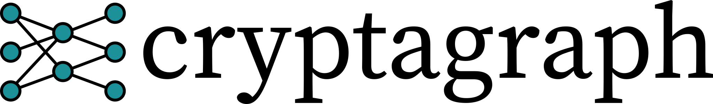

# Introduction <a name="introduction"></a>
*cryptagraph* is a tool for linear and differential cryptanalysis of block ciphers written in Rust.
*cryptagraph* is meant to make the life of cryptanalysts, as well as cipher designers, easier.
*cryptagraph* is licensed under GNU GPL v3.0.

1. [Introduction](#introduction)
2. [What is *cryptagraph*?](#what)
3. [Okay, what's the catch?](#catch)
4. [Compiling and Running](#install)
5. [Supported Ciphers](#ciphers)
6. [Usage Example](#example)
7. [Visualising with `graphtool`](#graphtool)
8. [How does all this work?](#background)
9. [Adding Ciphers](#adding)

# What is *cryptagraph*? <a name="what"></a>
*cryptagraph* is a tool for linear and differential cryptanalysis of block ciphers. More
specifically, *cryptagraph* allows you to search for good linear approximations or differentials of
block ciphers, as well as randomly sampling from correlation distributions in the case of linear
cryptanalysis.

*cryptagraph* was born out of a simple frustration: linear and differential cryptanalysis is in
principle easy, but finding good approximations and differentials is often a painful process.
Indeed, we often found ourselves implementing cipher specific tools with ad hoc search algorithms
that couldn't easily be used on other ciphers.

While different tools have been proposed in the literature with similar goals to *cryptagraph*, we
see two main drawbacks with these. Firstly, they are almost always based on MILP or SAT. Thus, they
require that a user knows how to model the cipher and search criteria in these frameworks. Moreover,
MILP and SAT are very general tools, which means that they might not exploit very specific
properties of the problem. Secondly, the proposed tools almost always focus on finding either the
best trail, or finding one trail at a time. If a linear approximation or differential consists of
several billion trails, this seems inefficient.

*cryptagraph* tries to address these issues by:
- Using an algorithm specifically designed for linear/differential trail search. Specifically, all
  trails in a specific subspace are found simultaneously, making it feasible to find a very large
  number of trails per approximation/differential.
- Making it easy to add new ciphers to the tool. In fact, adding ciphers to the tool is more or less
  the same as implementing the cipher -- no need to mess around with CNFs, etc. (Admittedly, there
  are some caveats to this step. See the next section for details).

It is our hope that these properties will help researchers to find better attacks on existing
ciphers, as well as help cipher designers make more informed decisions.

# Okay, what's the catch? <a name="catch"></a>
The problem that *cryptagraph* tries to solve is basically this: Given an incredibly huge, directed,
multistage graph, approximate the sum of the length of all paths between a vertex in the first stage
and the last stage. This turns out to be a really hard problem if we want to make the approximation
as good as possible. Thus, *cryptagraph* has some limitations.

### Cipher support
Currently, *cryptagraph* only supports a specific range of block ciphers. The limitations are
outlined below. Note that despite these, *cryptagraph* currently supports 23 different ciphers.
- SPN ciphers with a round function that can somehow be expressed as an application of parallel
  S-boxes, followed by some linear function. A prime example of this would be the AES.
- Feistel ciphers with SPN-like round functions are supported, but many of the optimisations
  *cryptagraph* uses only applies to SPN ciphers. Thus, expect poorer results for Feistel ciphers.
  Hopefully, we'll figure out how to improve this.
- Block sizes up to 128 bits are supported.
- The use of different S-boxes inside the round function is supported. However, the use of different
  S-boxes in different rounds is not.
- Ciphers with a Prince-like structure (i.e. with reflection in the middle) are supported.
- ARX and And-RX ciphers are not currently supported. We have some ideas on how to do this, but
  haven't implemented it yet.

### Resource requirements
While *cryptagraph* has been tuned to be relatively fast and use relatively little memory, it can't
perform magic. Thus, the resource usage can get pretty heavy. For serious use, we recommend having a
high-performance computing cluster on hand.

 - **CPU:** Most of the code is fully threaded, so *cryptagraph* will happily use all the cores you
   give it. Additionally, it scales fairly well, so the more cores the merrier.
 - **RAM:** The memory usage is highly dependent on the specific cipher and search space. We have
   done a lot to minimise RAM consumption, but if we choose a large enough search space,
   *cryptagraph* will easily consume more than 250 GB of RAM. Basically, the more accurate results
   you want, the more memory you will likely need.


# Compiling and Running <a name="install"></a>

## Compiling *cryptagraph*
In order to compile *cryptagraph*, you will need the nightly verson of the Rust compiler, `rustc`.
The easiest way to do this is to install the rust toolchain using `rustup`. For instructions, click
[here](https://rustup.rs/). Once installed, you can set the nightly compiler as your default by
running
```
rustup default nightly
```
You can then compile *cryptagraph* using the following commands.
```
git clone https://gitlab.com/psve/cryptagraph cd cryptagraph/src cargo build --release
```
The executable can then be found in the `cryptagraph/src/target/release` folder.

## Running *cryptagraph*
*cryptagraph* has two modes: `search` and `dist`. The `search` mode will try to find good
approximations or differentials, while the `dist` mode will allow you to sample key-dependent linear
correlations. For more details, see the example section.

#### Search Mode
Search mode can be invoked by calling `cryptagraph search`. It takes nine parameters.

 - `--type` (`-t`): Either `linear` or `differential`, depending on the type of property to search
   for.
 - `--cipher` (`-c`): The name of the cipher to analyse. See the section on supported ciphers for a
   list of names.
 - `--rounds` (`-r`): A positive integer. The number of rounds of the cipher to analyse.
 - `--patterns` (`-p`): A positive integer. Essentially determines the size of the search space.
 - `--anchors` (`-a`): (*Optional*) A positive integer. Increases the search space for the first and
   last round. This can greatly improve results for some ciphers. Defaults to 17.
 - `--num_keep` (`-n`): (*Optional*) A positive integer. The number of approximations/differentials
   to return. Defaults to 20.
 - `--mask_in` (`-i`): (*Optional*) Path to a file which restricts the input and output values of
   the approximations/differentials. Each line of the file must have the form `input,output` where
   both values are in hexadecimal without the `0x` prefix.
 - `--mask_out` (`-o`): (*Optional*) Path to a file where the result will be saved. The file
   `file_name.set` will be generated.
 - `--file_graph` (`-g`): (*Optional*) Path to a file where graph data will be saved. This can be
   used to visualise the search graph. See the section on `graphtool` for details.

#### Dist Mode
Distribution mode can be invoked by calling `cryptagraph dist`. It takes six parameters.
 - `--cipher` (`-c`): The cipher to generate correlations for.
 - `--rounds` (`-r`): The number of rounds to generate correlations for.
 - `--keys` (`-k`): The number of random master keys to use.
 - `--masks` (`-m`): Path to a file containing intermediate masks to use. This is the `filename.set`
   file generated when using the `--mask_out` option in search mode.
 - `--output` (`-o`): Path to a file where the results will be saved. The file `file_name.corrs`
   will be generated.
 - `--mask_in` (`-i`): (*Optional*) Path to a file which restricts the input and output values of
   the approximations/differentials. Each line of the file must have the form `input,output` where
   both values are in hexadecimal without the `0x` prefix.

# Supported Ciphers <a name="ciphers"></a>
The following ciphers are currently supported. Some ciphers only have support for trail search, and
not for finding correlation distributions.

| Cipher       | Name        |
| ------------ | ----------- |
| AES          | `aes`       |
| BORON        | `boron`     |
| DES          | `des`       |
| EPCBC(48,96) | `epcbc48`   |
| EPCBC(96,96) | `epcbc96`   |
| Fly          | `fly`       |
| GIFT-64      | `gift64`    |
| GIFT-128     | `gift128`   |
| Halka        | `halka`     |
| Iceberg      | `iceberg`   |
| Khazad       | `khazad`    |
| KLEIN        | `klein`     |
| LED          | `led`       |
| MANTIS       | `mantis`    |
| mCrypton     | `mcrypton`  |
| MIBS         | `mibs`      |
| Midori       | `midori`    |
| PRESENT      | `present`   |
| PRIDE        | `pride`     |
| PRINCE       | `prince`    |
| PUFFIN       | `puffin`    |
| Qarma        | `qarma`     |
| RECTANGLE    | `rectangle` |
| SKINNY-64    | `skinny64`  |
| SKINNY-128   | `skinny128` |
| TWINE        | `twine`     |


# Usage Example <a name="example"></a>
We will demonstrate how to use *cryptagraph* by using it to find linear approximations for 22 rounds
of the block cipher PRESENT. We do this by running the command
```
cryptagraph search --type linear --cipher present --rounds 22 --patterns 900 --anchors 0
```
We have here chosen to use 900 patterns and no anchors. This will produce the following output.
```
    Cipher: PRESENT.
    Property: Linear
    Rounds: 22.
    S-box patterns: 900
    Maximum anchors: 2^0


--------------------------------------- GENERATING GRAPH ---------------------------------------

Level 1.
24641665 properties (1781758 input, 1781758 output).
===================================================================================================
===================================================================================================
Added vertices [0.8682917570004065 s]
===================================================================================================
Graph has 12217 vertices and 638892 edges [0.3770285859991418 s]
Pruned graph has 12217 vertices and 638892 edges [0.00008380200051760767 s]
===================================================================================================
Graph has 27770 vertices and 1615171 edges [0.36392815399995015 s]
Pruned graph has 27770 vertices and 1615171 edges [0.0003226039989385754 s]
Number of good vertices: 27770 [0.008761731000049622 s]
===================================================================================================
Removed 1 dead patterns [0.015235347000270849 s]

Level 2.
24641664 properties (1781757 input, 1781757 output).
===================================================================================================
===================================================================================================
Added vertices [0.6025397180001164 s]
====================================================================================================
Graph has 155344 vertices and 1049436 edges [2.2053409149993968 s]
Pruned graph has 38570 vertices and 287867 edges [0.13607013499859022 s]
====================================================================================================
Graph has 151364 vertices and 1363298 edges [0.8241790720003337 s]
Pruned graph has 151364 vertices and 1363298 edges [0.0025165150000248104 s]
Number of good vertices: 151364 [0.0069836500006204005 s]
===================================================================================================
Removed 0 dead patterns [0.016840963000504416 s]

Level 3.
24641664 properties (1781757 input, 1781757 output).
===================================================================================================
===================================================================================================
Added vertices [0.9258645190002426 s]
===================================================================================================
Graph has 462511 vertices and 454426 edges [2.2372833409990562 s]
Pruned graph has 2355 vertices and 3699 edges [0.16755997500149533 s]
===================================================================================================
Graph has 19949 vertices and 23975 edges [0.43138818099942 s]
Pruned graph has 19949 vertices and 23975 edges [0.0012264860015420709 s]

Extending graph.
===================================================================================================
Extended graph has 37543 vertices and 44251 edges [0.4637725060001685 s]

Adding 0 anchors.
Anchored graph has 37543 vertices and 44251 edges [0.002203260999522172 s]

Patching graph.
===================================================================================================
Adding 30774 patch edges.
Patched graph has 20067 vertices and 54969 edges [0.03654991699841048 s]

Final graph has 20067 vertices and 54969 edges

------------------------------------- FINDING PROPERTIES ---------------------------------------

Finding properties (15064 input values, 54969 edges):
====================================================================================================

Found 22794018 properties. [0.9084983730008389 s]

------------------------------------------ RESULTS ---------------------------------------------

Search finished. [10.649769996000032 s]
Smallest value: -143.71047962402184
Largest value:  -58.52890919151743

Total number of trails:  253209895592119
Approximation: (000000000000000000000e0000000000,00000000000000000020000000200020) [86698690, -58.52890919151743]
Approximation: (000000000000000000000e0000000000,00000000000000002000000020002000) [86698690, -58.52890919151743]
Approximation: (000000000000000000000e0000000000,00000000000000000080000000800080) [86698690, -58.52890919151743]
Approximation: (000000000000000000000e0000000000,00000000000000008000000080008000) [86698690, -58.52890919151743]
Approximation: (00000000000000000000000000e00000,00000000000000000020000000200020) [86698690, -58.52890919151743]
Approximation: (00000000000000000000000000e00000,00000000000000002000000020002000) [86698690, -58.52890919151743]
Approximation: (00000000000000000000000000e00000,00000000000000000080000000800080) [86698690, -58.52890919151743]
Approximation: (00000000000000000000000000e00000,00000000000000008000000080008000) [86698690, -58.52890919151743]
Approximation: (0000000000000000000000e000000000,00000000000000000020000000200020) [86698690, -58.52890919151743]
Approximation: (0000000000000000000000e000000000,00000000000000002000000020002000) [86698690, -58.52890919151743]
Approximation: (0000000000000000000000e000000000,00000000000000000080000000800080) [86698690, -58.52890919151743]
Approximation: (0000000000000000000000e000000000,00000000000000008000000080008000) [86698690, -58.52890919151743]
Approximation: (0000000000000000000000000e000000,00000000000000000020000000200020) [86698690, -58.52890919151743]
Approximation: (0000000000000000000000000e000000,00000000000000002000000020002000) [86698690, -58.52890919151743]
Approximation: (0000000000000000000000000e000000,00000000000000000080000000800080) [86698690, -58.52890919151743]
Approximation: (0000000000000000000000000e000000,00000000000000008000000080008000) [86698690, -58.52890919151743]
Approximation: (000000000000000000000a0000000000,00000000000000000020000000200020) [66232114, -58.69704433392103]
Approximation: (000000000000000000000a0000000000,00000000000000002000000020002000) [66232114, -58.69704433392103]
Approximation: (000000000000000000000a0000000000,00000000000000000080000000800080) [66232114, -58.69704433392103]
Approximation: (000000000000000000000a0000000000,00000000000000008000000080008000) [66232114, -58.69704433392103]
```
We first see a graph generation stage, in which a graph representing linear trails is generated.
Then, this graph is searched in order to find good linear approximations. The input and output masks
for the 20 best approximations found are output, as well as the number of linear trails and the ELP
for each approximation. *cryptagraph* tells us that it found a total of 253209895592119
(2<sup>47.85</sup>) trails across 22794018 approximations in just 10 seconds. For the best
approximation, we found 86698690 trails for a total ELP of 2<sup>-58.53</sup>.

If we next want to take a closer look at the key-dependent correlation distribution of these
approximations, we first need to add the `--mask_out` option to the above call. Say we use the
command
```
cryptagraph search --type linear --cipher present --rounds 22 --patterns 900 --anchors 0 --mask_out
present
```
A file called `present.set` will be created which we can pass to the distribution mode, e.g. by
running
```
cryptagraph dist --cipher present --rounds 22 --keys 1000 --masks present.set --mask_in present.io
--output present
```
The file `present.io` contains a list of the 20 approximations we found above. We get the following
output
```
Cipher: PRESENT
Properties masks: 20
Intermediate masks: 17535
Calculating full approximation table.
====================================================================================================
Generating correlations.
====================================================================================================
Generation finished. [74.2320677459993 s]
```
A CSV file `present.corrs` with the result is generated. The first header line of the file contains
the names of the approximations. Each subsequent line is a list of 20 correlations, one for each
approximation, generated for a specific master key.

# Visualising with `graphtool` <a name="graphtool"></a>
By specifying the `--file_graph` option, the python module `graphtool` (found
[here](https://graph-tool.skewed.de/)) can be used to visualise the search graph generated by
*cryptagraph* (warning: the resulting output file when using this option can be very large).

For example, if we run
```
cryptagraph -t linear -c mantis -r 4 -p 2000 -g mantis
```
a file `mantis.graph` is generated. The `graph_plot.py` script found in the `utility` folder can the
be used to generate the following picture. 

# How does all this work? <a name="background"></a>
If you want to know more about the algorithm *cryptagraph* uses you can read (most of) the details
in our paper "Generating Graphs Packed with Paths" published in Transactions on Symmetric Cryptology
2018, Issue 3. The paper can be accessed for free [here](https://eprint.iacr.org/2018/764).

If you want to know more about the Rust library, you can view the code documentation by running
```
cargo doc --no-deps --open
```

If you, after reading all that, have any ideas on how to improve the algorithm, please do let us
know!

# Adding Ciphers <a name="adding"></a>

In *cryptagraph* a cipher is essentially a struct which implements the `Cipher` trait. For more
information on Rust traits, click
[here](https://doc.rust-lang.org/book/second-edition/ch10-02-traits.html). For a good example, see
the [SKINNY
implementation](https://gitlab.com/psve/cryptagraph/blob/master/src/src/cipher/skinny64.rs). We will
breifly cover the most important functions of the `Cipher` trait in the following.

 - `sbox` should return a reference to a variable of type `Sbox` which represents the S-box used by
   the cipher. Usually, the given cipher struct contains this variable. Note that `sbox` takes an
   index as argument, which can be used in the case of multiple different S-boxes being used in each
   round.
 - `linear_layer` (and `linear_layer_inv`) should implement the linear part of the round function
   (respectively, its inverse), excluding the key addition.
 - `key_schedule` should return a vector of round-keys (potentially combined with constants). Note
   that for `r` rounds this should include any whitening keys (see also the `whitening` function of
   the `Cipher` trait).
 - `sbox_mask_transform` should transform a set of input/output masks or differences of the S-boxes
   layer to a set of input/output masks for a round. For most SPN ciphers, this simply consists of
   applying the linear layer to the output mask. Note however, that for Feistel ciphers, this
   transformation is only possible if we consider two rounds of the cipher. Moreover, the
   transformation for linear approximations and differentials are different. See e.g. the [MIBS
   implementation](https://gitlab.com/psve/cryptagraph/blob/master/src/src/cipher/mibs.rs) for an
   example.
 - `encrypt` and `decrypt` should simply perform encryption and decryption, and are only included so
   that tests can be written.
 - For Prince-like ciphers, the `reflection_layer` function must be implemented. See the [Prince
   implementation](https://gitlab.com/psve/cryptagraph/blob/master/src/src/cipher/prince.rs) for an
   example.

Once a new module with the cipher implementation has been created, add it to the `src/cipher/mod.rs`
file and update the `name_to_cipher` function which can also be found in that file.

Finally, note that (aside from `encrypt` and `decrypt`) the `key_schedule` and `whitening` functions
are not needed for the `search` mode to work. This can greatly simplify adding ciphers for an
initial analysis.